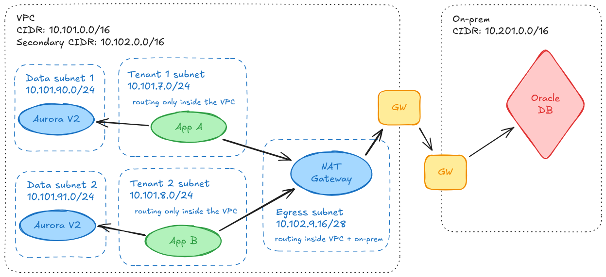
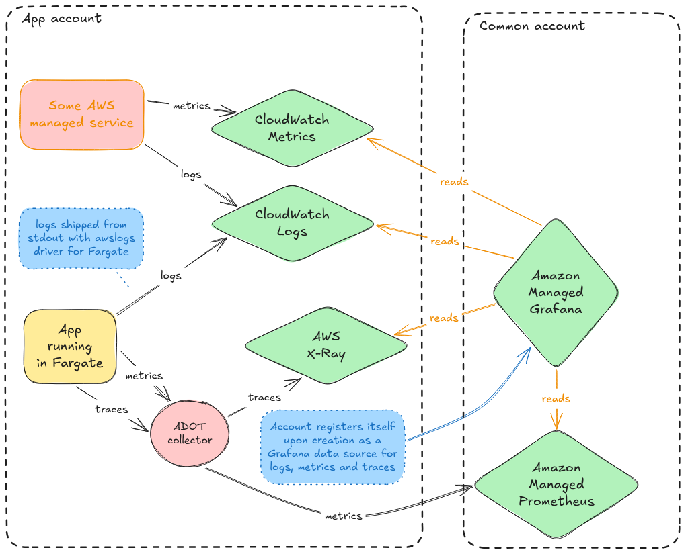

# Networking

This section explains how networking works for `eurus-aws`. Please
note that only IPv4 is supported. There is no support for IPv6.

There is one VPC per environment. Each VPC has a primary CIDR
associated with it. It is possible to associate secondary CIDR to the
VPC in order to setup egress to some external networks (typically to
on-prem services). Such CIDRs are typically allocated by the network
team to allow access to on-prem services.

Each VPC must spread over a minimum of two availability zones in order
to increase availability.

Each VPC has the following subnets:
  - Tenant subnets: These subnets host the tenant workloads and have
    no routing to/from outside the VPC. Ingress traffic must come from
    other AWS services such as CloudFront, API Gateways or load
    balancers. Egress traffic must go exclusively through NAT gateways
    located in the egress subnets. Each tenant will have its own set
    of tenant subnets (one such subnet per availability zone).
  - Data subnets: These subnets are used to host data stores. Only
    AWS managed data stores (such as RDS) are allowed in these
    subnets.
  - Egress subnets: These subnets hold NAT Gateways to manage egress
    traffic to external networks.

A few notes:
  - Data subnets and egress subnets typically need small CIDRs.
  - There is no direct access to the internet to/from the VPC.
  - How the VPC is linked to the on-prem networks is beyond the scope
    of this project.

Since this project is geared towards medium-to-large businesses, it is
somewhat uncommon such businesses have on-prem workloads/databases to
connect to. So `eurus-aws` will provide an egress solution, but it
will be shared between tenants and thus may be subject to the "noisy
neighbour" problem. This is the tradeoff in order to keep cost low,
given that the egress solution is based on NAT Gateways which aren't
cheap.

In terms of ingress, the amount of traffic will depend on the client
apps themselves as much as the apps running inside the platform. There
are many variables outside the control of the tenants (eg: how clients
behave, DDoS attack, network configuration, etc.) so some variability
in the ingress traffic is inevitable. Consequently, there will be only
one ingress per environment (as opposed to a segregated ingress for
each tenant).

# Observability and alerting

## Generalities

This section explains how observability and alerting work for
`eurus-aws`.

The observability stack is comprised of:
  - **Logs**: CloudWatch Logs; rationale: the only other AWS managed
    solution is OpenSearch, and it is cheaper only for very large
    workloads, and `eurus-aws` is geared towards workloads that are
    medium to large in size
  - **Metrics generated by AWS managed services**: CloudWatch Metrics;
    virtually all AWS managed services send their metrics to
    CloudWatch Metrics; replicating those metrics to Prometheus is not
    trivial and typically introduces a delay, so the decision is to
    not replicate those metrics to Prometheus
  - **Custom metrics**: Amazon Managed Prometheus; rationale: costs
    for CloudWatch Metrics can explode quickly given that it has a
    per-metric charge, additionally Prometheus is much more flexible
    in terms of querying
  - **Distributed tracing**: AWS X-Ray as it is the only option
  - **Visualisation**: Amazon Managed Grafana; rationale: Grafana is
    the standard for visualisation and thus has numerous open-source
    dashboards compared to CloudWatch Dashboards; additionally, users
    and DevOps/SRE engineers know it much better than the obvious
    alternative which is CloudWatch Dashboards.

Alerting based on custom metrics will be handled by Amazon Managed
Prometheus, which has a soft limit of [1,000 alerts and a hard limit
of
2,000](https://docs.aws.amazon.com/prometheus/latest/userguide/AMP_quotas.html),
which compares much more favourably than the [hard limit of 100 for
Amazon Managed
Grafana](https://docs.aws.amazon.com/grafana/latest/userguide/AMG_quotas.html).

Alerting based on metrics from AWS managed services will be managed by
CloudWatch Alarms.

NB: There are ways to convert CloudWatch Metrics into Prometheus
metrics, but these are non-trivial and I decided not to do it in order
to reduce the amount of moving parts and reduce risks of things going
wrong.

## Detailed explanation of metrics and traces

Each environment will run a standalone ADOT collector in the
platform's ECS cluster (an ECS cluster per environment dedicated to
platform components).

Each ECS task will run an ADOT collector sidecar container, which will
be responsible for:
  - Collecting metrics and traces from the app itself
  - Collecting container insights metrics using the
    `awsecscontainermetrics` receiver (which read such metrics from
    the Task Metadata Endpoint v4)
  - Forwarding metrics and traces to the environment's ADOT collector

The environment's ADOT collector will then forward the metrics to the
realm's AMP write endpoint, and the traces to AWS X-Ray in the local
AWS account. It will also be responsible to filter out any potentially
problematic metrics or traces and thus act as a gateway to prevent the
tenants from overwhelming AMP or X-Ray.

# Tenant segregation and onboarding

Tenant workloads must run in a closed subnet (i.e. with no direct
access to/from anything outside the VPC). In order to increase
security and minimise the chances of one tenant exhausting the IP
address pool of such a subnet, there will be one tenant subnet per
tenant per availability zone.

On the database side of things, AWS provides an excellent serverless
SQL database service: Aurora Serverless V2. It scales from almost 0 to
almost infinity. For NoSQL, AWS provides DynamoDB which is lightning
fast and scale again from 0 to infinity. The problem with DynamoDB is
that it is proprietary and quite rudimentary, so moving from MongoDB
and suchlike to DynamoDB would be a pain. AWS does provide DocumentDB
which is 100% compatible with MongoDB, but it is not truly serverless.

There is also a question of apportioning costs to tenants according to
how much of the database they use. Using a single database instance
shared amongst all tenants will make it difficult to apportion costs
effectively. On top of that, it exposes tenants to the "noisy
neighbour" problem, where a single tenant can crowd out the other
tenants and starve them of database access.

Overall, I decided to segregate tenant's databases. Most applications
still use SQL databases, and Aurora Serverless V2 does an excellent
job here for Postgres and MySQL. If a tenant has other requirements,
such as Redis, MongoDB, DB2 or Oracle, they will have to pay extra for
a dedicated database instance/cluster.

The resources that are dedicated to a given tenant will be created
when this specific tenant is onboarded (as opposed to the platform
itself being updated). These resources are:
  - Dedicated tenant subnets
  - Dedicated database subnets
  - Dedicated ECS cluster backed by Fargate
